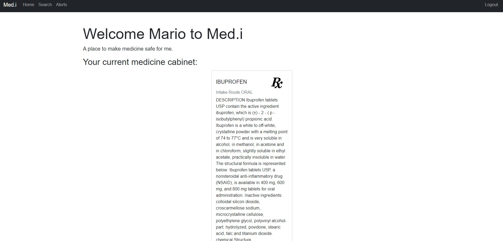

# Med.i

Github Link: [Github Repo link](https://github.com/margotcooper/med-interactions)
Heroku Link: [Heroku App Link](https://medinte.herokuapp.com/login)

## Description

The motivation for the creation of Med.i was to provide an easier way for patients to keep track of their medication, learn more about their medication, and any pharmaceutical recalls.

When filling a prescription, patients usually disregard the accompanying paperwork which includes important medical information like dosage, route of medication administration, and medication interactions. Med.i simplifies the process of keeping track of all that information in one simple place. Med.i users can save their medication information, search for any potential negative interations with other medication, and even make useful comments for other users about specific medication.

## Table of Contents

- [Descritpion](#description)
- [Installation](#installation)
- [Usage](#usage)
- [Screenshots](#screenshots)
- [Credits](#credits)
- [How to Contribute](#how-to-contribute)
- [License](#license)

## Installation

- Install the dependencies by running the following:

`npm i `

## Usage

- Use the terminal to source the schema file in MYSQL:

`source db/schema.sql`

- Then seed the database by running the following:

`npm run seed`

- Finally run the application:

`npm start`

## Screenshots

## Credits

This was a joint project between the following developers:

- [Anthony To Github](https://github.com/toTOEro)
- [Margot Cooper Github](https://github.com/margotcooper)
- [Hector De La Cruz Github](https://github.com/Hdela99)
- [Mario Armstrong Github](https://github.com/MarioArmstrong)

## How to Contribute

## License

MIT License 

Copyright (c) 2022 Mario Armstrong

Permission is hereby granted, free of charge, to any person obtaining a copy
of this software and associated documentation files (the "Software"), to deal
in the Software without restriction, including without limitation the rights
to use, copy, modify, merge, publish, distribute, sublicense, and/or sell
copies of the Software, and to permit persons to whom the Software is
furnished to do so, subject to the following conditions:

The above copyright notice and this permission notice shall be included in all
copies or substantial portions of the Software.

THE SOFTWARE IS PROVIDED "AS IS", WITHOUT WARRANTY OF ANY KIND, EXPRESS OR
IMPLIED, INCLUDING BUT NOT LIMITED TO THE WARRANTIES OF MERCHANTABILITY,
FITNESS FOR A PARTICULAR PURPOSE AND NONINFRINGEMENT. IN NO EVENT SHALL THE
AUTHORS OR COPYRIGHT HOLDERS BE LIABLE FOR ANY CLAIM, DAMAGES OR OTHER
LIABILITY, WHETHER IN AN ACTION OF CONTRACT, TORT OR OTHERWISE, ARISING FROM,
OUT OF OR IN CONNECTION WITH THE SOFTWARE OR THE USE OR OTHER DEALINGS IN THE
SOFTWARE.
